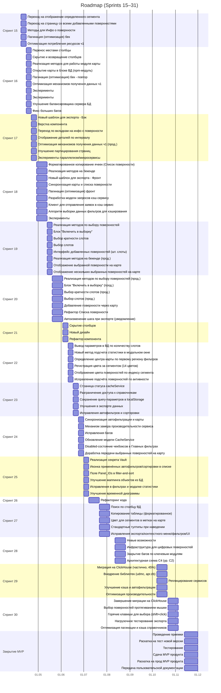

```mermaid
gantt
    title Roadmap (Sprints 15–31)
    dateFormat  YYYY-MM-DD
    axisFormat  %d.%m

    section Спринт 15
    Переход на отображение определенного сегмента :s15t1, 2025-04-08, 2025-04-15
    Переход на страницу со всеми добавленными поверхностями :s15t2, 2025-04-08, 2025-04-15
    Методы для Инфо о поверхности :s15t3, 2025-04-08, 2025-04-15
    Пагинация (оптимизация) бек :s15t4, 2025-04-08, 2025-04-15
    Оптимизация потребления ресурсов ч1 :s15t5, 2025-04-08, 2025-04-15

    section Спринт 16
    Перенос местами столбцы :s16t1, 2025-04-15, 2025-04-22
    Скрытие и возвращение столбцов :s16t2, 2025-04-15, 2025-04-22
    Реализация методов для работы модуля карты :s16t3, 2025-04-15, 2025-04-22
    Открытие карты в блоке ВД (npm-модуль) :s16t4, 2025-04-15, 2025-04-22
    Пагинация (оптимизация) бек - повтор :s16t5, 2025-04-15, 2025-04-22
    Оптимизация механизмов получения данных ч1 :s16t6, 2025-04-15, 2025-04-22
    Эксперименты: параллелизм запросов к БД ч1 :s16t7, 2025-04-15, 2025-04-22
    Эксперименты: разделение на микросервисы (часть) :s16t8, 2025-04-15, 2025-04-22
    Улучшение балансировщика сервера БД :s16t9, 2025-04-15, 2025-04-22
    Фикс больших багов :s16t10, 2025-04-15, 2025-04-22

    section Спринт 17
    Новый шаблон для экспорта - Бэк :s17t1, 2025-04-22, 2025-04-29
    Верстка компонента :s17t2, 2025-04-22, 2025-04-29
    Переход по вкладкам на инфо о поверхности :s17t3, 2025-04-22, 2025-04-29
    Отображение деталей по интервалу :s17t4, 2025-04-22, 2025-04-29
    Оптимизация механизмов получения данных ч1 (прод.) :s17t5, 2025-04-22, 2025-04-29
    Улучшение партицирования страниц :s17t6, 2025-04-22, 2025-04-29
    Эксперименты параллелизм/микросервисы :s17t7, 2025-04-22, 2025-04-29

    section Спринт 18
    Форматированное копирование ячеек (Список поверхности) :s18t1, 2025-04-29, 2025-05-13
    Реализация методов на бекенде :s18t2, 2025-04-29, 2025-05-13
    Новый шаблон для экспорта - Фронт :s18t3, 2025-04-29, 2025-05-13
    Синхронизация карты и списка поверхности :s18t4, 2025-04-29, 2025-05-13
    Пагинация (оптимизация) фронт :s18t5, 2025-04-29, 2025-05-13
    Разработка модели запросов кэш сервису :s18t6, 2025-04-29, 2025-05-13
    Клиент для отправления заявок в кэш сервис :s18t7, 2025-04-29, 2025-05-13
    Алгоритм выборки данных фильтров для кэширования :s18t8, 2025-04-29, 2025-05-13
    Эксперименты: микросервисы (прод.) :s18t9, 2025-04-29, 2025-05-13

    section Спринт 19
    Реализация методов по выбору поверхностей :s19t1, 2025-05-13, 2025-05-20
    Блок "Включить в выборку" :s19t2, 2025-05-13, 2025-05-20
    Выбор кратности слотов :s19t3, 2025-05-13, 2025-05-20
    Выбор слотов :s19t4, 2025-05-13, 2025-05-20
    Интерфейс добавленных поверхностей (шт. слоты) :s19t5, 2025-05-13, 2025-05-20
    Реализация методов на бекенде (прод.) :s19t6, 2025-05-13, 2025-05-20
    Отображение выбранной поверхности на карте :s19t7, 2025-05-13, 2025-05-20
    Отображение нескольких выбранных поверхностей на карте :s19t8, 2025-05-13, 2025-05-20

    section Спринт 20
    Реализация методов по выбору поверхностей (прод.) :s20t1, 2025-05-20, 2025-06-03
    Блок "Включить в выборку" (прод.) :s20t2, 2025-05-20, 2025-06-03
    Выбор кратности слотов (прод.) :s20t3, 2025-05-20, 2025-06-03
    Выбор слотов (прод.) :s20t4, 2025-05-20, 2025-06-03
    Добавление поверхности через карту :s20t5, 2025-05-20, 2025-06-03
    Рефактор Списка поверхности :s20t6, 2025-05-20, 2025-06-03
    Автоизменение шага при экспорте (уведомление) :s20t7, 2025-05-20, 2025-06-03

    section Спринт 21
    Скрытие столбцов :s21t1, 2025-06-03, 2025-06-10
    Новый дизайн :s21t2, 2025-06-03, 2025-06-10
    Рефактор компонента :s21t3, 2025-06-03, 2025-06-10

    section Спринт 22
    Вывод параметров в ВД по количеству слотов :s22t1, 2025-06-10, 2025-06-17
    Новый метод подсчета статистики в модальном окне :s22t2, 2025-06-10, 2025-06-17
    Определение центра карты по первому региону фильтров :s22t3, 2025-06-10, 2025-06-17
    Регистрация цвета за сегментом (14 цветов) :s22t4, 2025-06-10, 2025-06-17
    Отображение цвета поверхностей по индексу сегмента :s22t5, 2025-06-10, 2025-06-17
    Исправление подсчёта поверхностей по активности :s22t6, 2025-06-10, 2025-06-17

    section Спринт 23
    Страница статуса cacheService :s23t1, 2025-06-17, 2025-06-24
    Разграничение доступа к справочникам :s23t2, 2025-06-17, 2025-06-24
    Сохранение query-параметров в localStorage :s23t3, 2025-06-17, 2025-06-24
    Улучшения в экспорте данных :s23t4, 2025-06-17, 2025-06-24
    Исправления автофильтров и сортировки :s23t5, 2025-06-17, 2025-06-24

    section Спринт 24
    Синхронизация автофильтрации и карты :s24t1, 2025-06-24, 2025-07-01
    Механизм замера производительности сервиса :s24t2, 2025-06-24, 2025-07-01
    Исправления багов: экспорт/модалки/чёрная модалка :s24t3, 2025-06-24, 2025-07-01
    Обновление модели CacheService :s24t4, 2025-06-24, 2025-07-01
    Disabled-состояние чекбоксов в Главных фильтрах :s24t5, 2025-06-24, 2025-07-01
    Доработка передачи выбранных поверхностей на карту :s24t6, 2025-06-24, 2025-07-01

    section Спринт 25
    Реализация секрета Vault :s25t1, 2025-07-01, 2025-07-08
    Иконка применённых автофильтров/сортировки в списке :s25t2, 2025-07-01, 2025-07-08
    Поле Panel_IDs в filter-and-sort :s25t3, 2025-07-01, 2025-07-08
    Улучшение маппинга объектов из БД :s25t4, 2025-07-01, 2025-07-08
    Исправления в фильтрах и модалке статистики :s25t5, 2025-07-01, 2025-07-08
    Улучшение временной диаграммы :s25t6, 2025-07-01, 2025-07-08

    section Спринт 26
    Рефакторинг кода :s26t1, 2025-07-08, 2025-07-22

    section Спринт 27
    Поиск по столбцу ВД :s27t1, 2025-07-22, 2025-08-05
    Копирование таблицы (форматированное) :s27t2, 2025-07-22, 2025-08-05
    Цвет для сегментов в метках на карте :s27t3, 2025-07-22, 2025-08-05
    Стандартные тултипы при наведении :s27t4, 2025-07-22, 2025-08-05
    Исправления экспорта/контекстного меню/фильтров/UI :s27t5, 2025-07-22, 2025-08-05

    section Спринт 28
    Новые возможности: карты/временная диаграмма/автофильтрация :s28t1, 2025-08-12, 2025-08-26
    Инфраструктура для цифровых поверхностей :s28t2, 2025-08-12, 2025-08-26
    Закрытие багов по ключевым модулям :s28t3, 2025-08-12, 2025-08-26
    Архитектурная схема C4 (ур. C2) :s28t4, 2025-08-12, 2025-08-26

    section Спринт 29
    Миграция на ClickHouse (частично, 45%) :s29t1, 2025-10-07, 2025-10-21
    Внедрение библиотек (udmc, apr.db) :s29t2, 2025-10-07, 2025-10-21
    Реплицирование сервисов :s29t3, 2025-10-07, 2025-10-21
    Улучшение кэша и автофильтрации :s29t4, 2025-10-07, 2025-10-21
    Оптимизация производительности :s29t5, 2025-10-07, 2025-10-21

    section Спринт 30
    Завершение миграции на ClickHouse :s30t1, 2025-10-22, 2025-11-05
    Выбор поверхностей протягиванием мышки :s30t2, 2025-10-22, 2025-11-05
    Горячие клавиши для выбора (shift+click) :s30t3, 2025-10-22, 2025-11-05
    Нагрузочное тестирование экспорта :s30t4, 2025-10-22, 2025-11-05
    Оптимизация пагинации и кэша справочников :s30t5, 2025-10-22, 2025-11-05

    section Закрытие MVP
    Проведение приемки :s31t1, 2025-11-13, 2025-12-01
    Раскатка на тест новой версии :s31t2, 2025-11-13, 2025-12-01
    Тестирование :s31t3, 2025-11-13, 2025-12-01
    Сдача MVP продукта :s31t4, 2025-11-13, 2025-12-01
    Раскатка на прод  MVP продукта :s31t5, 2025-11-13, 2025-12-01
    Передача пользовательской документации :s31t6, 2025-11-13, 2025-12-01
```

